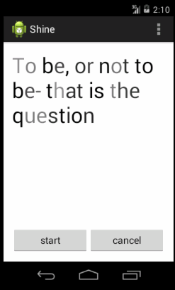

# Shine for Android
[](https://github.com/wangdaliu/ShineTextView/blob/master/shine.gif)

## How to use

Add a `ShineTextView` to your layout:
```xml
<com.shine.library.ShineTextView
    android:id="@+id/shine_view"
    android:layout_width="match_parent"
    android:layout_height="wrap_content"
    android:textSize="40sp"
    android:textColor="@android:color/black"/>
```

To start the animation:
```java
mShine = new Shine(DEFAULT_DURATION, DEFAULT_START_DELAY, shineList);
mShine.start(mShineTextView);
```

To stop it:
```java
if (mShine != null && mShine.isAnimating()) {
    mShine.cancel();
}
```
## Sample

See the [sample](https://github.com/wangdaliu/ShineTextView/master/sample) for a common use of this library.

